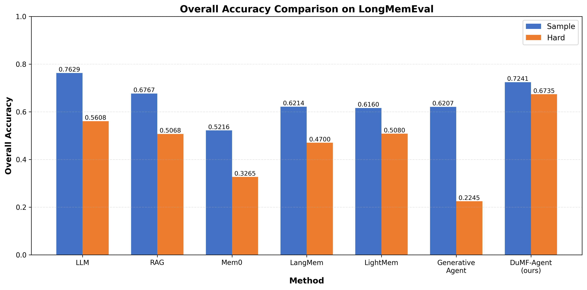

# DuMF-Agent: Dual-Channel Memory Framework for Long-Term Conversational Agents

A long-term memory architecture for conversational AI that addresses memory fragmentation, temporal confusion, and cross-session reasoning instability through unified memory representation, retrieval-reading closed-loop, and temporal version consistency mechanisms.

## Architecture Overview

```
┌─────────────────────────────────────────────────────────────────────────────┐
│                           DuMF-Agent Architecture                           │
├─────────────────────────────────────────────────────────────────────────────┤
│                                                                             │
│  ┌─────────────┐    ┌──────────────────────────────────────────────────┐   │
│  │   User      │    │              Dual-Channel Memory                 │   │
│  │   Query     │───▶│  ┌────────────────┐  ┌────────────────────────┐ │   │
│  └─────────────┘    │  │  RAW Channel   │  │  CONSOLIDATED Channel  │ │   │
│                     │  │  (Evidence)    │  │  (SimpleFact + Triple) │ │   │
│                     │  └────────────────┘  └────────────────────────┘ │   │
│                     └──────────────────────────────────────────────────┘   │
│                                      │                                      │
│                     ┌────────────────▼────────────────┐                    │
│                     │      Hybrid Retrieval           │                    │
│                     │  • Query Expansion              │                    │
│                     │  • Vector + BM25 + Multi-hop    │                    │
│                     │  • Unified Re-ranking           │                    │
│                     └────────────────┬────────────────┘                    │
│                                      │                                      │
│                     ┌────────────────▼────────────────┐                    │
│                     │      Context Construction       │                    │
│                     │  • Version Detection            │                    │
│                     │  • Temporal Filtering           │                    │
│                     │  • Evidence Organization        │                    │
│                     └────────────────┬────────────────┘                    │
│                                      │                                      │
│                     ┌────────────────▼────────────────┐                    │
│                     │         LLM Generation          │                    │
│                     └─────────────────────────────────┘                    │
│                                                                             │
└─────────────────────────────────────────────────────────────────────────────┘
```

## Key Features

- **Three-Layer Memory Representation**: Evidence (RAW/TextUnit), Language (SimpleFact), and Structure (Structured Triple) layers with cross-references for traceable reasoning
- **Retrieval-Reading Closed-Loop**: Query expansion, hybrid retrieval (vector + BM25 + multi-hop), and unified re-ranking with confidence-aware scoring
- **Temporal Version Consistency**: Append-only storage with dynamic version detection to distinguish current vs. historical facts

## Installation

### Prerequisites

- Python 3.9+
- Neo4j 5.x (local or Aura cloud)
- CUDA-compatible GPU (optional, for local embeddings)

### Setup

1. Clone the repository:
```bash
git clone https://github.com/yourusername/DuMF-Agent.git
cd DuMF-Agent
```

2. Create virtual environment:
```bash
python -m venv .venv
source .venv/bin/activate  # Linux/Mac
# or
.venv\Scripts\activate     # Windows
```

3. Install dependencies:
```bash
pip install -r requirements.txt
```

4. Configure environment:
```bash
cp .env.example .env
# Edit .env with your API keys and database credentials
```

5. Initialize Neo4j schema:
```bash
python utils/init_neo4j_schema.py
python utils/create_fulltext_index.py
```

6. (Optional) Start local embedding server:
```bash
python embedding_server.py
```

## Data Preparation

This project uses the [LongMemEval](https://github.com/xiaowu0162/LongMemEval) benchmark for evaluation.

### Download Dataset

```bash
# Clone LongMemEval repository
git clone https://github.com/xiaowu0162/LongMemEval.git

# Copy test files to your project
mkdir -p data/long_memory_eval
cp LongMemEval/data/*.json data/long_memory_eval/
```

### Verify Directory Structure

```
data/
└── long_memory_eval/
    ├── longmemeval_oracle.json   # Sample setting
    └── longmemeval_s.json        # Hard setting
```

## Configuration

### Environment Variables (.env)

Copy `.env.example` to `.env` and configure the following:

#### Required Settings

```bash
# LLM API (OpenAI-compatible)
GRAPHRAG_API_BASE=https://api.openai.com/v1
GRAPHRAG_CHAT_API_KEY=sk-your-api-key-here
GRAPHRAG_CHAT_MODEL=gpt-4o-mini

# Cheap LLM for extraction tasks
CHEAP_GRAPHRAG_API_BASE=https://api.openai.com/v1
CHEAP_GRAPHRAG_CHAT_API_KEY=sk-your-api-key-here
CHEAP_GRAPHRAG_CHAT_MODEL=gpt-4o-mini

# Embedding Model
GRAPHRAG_EMBEDDING_API_BASE=http://127.0.0.1:8000  # Local server
GRAPHRAG_EMBEDDING_API_KEY=local
GRAPHRAG_EMBEDDING_MODEL=BAAI/bge-m3

# Neo4j Database
NEO4J_URI=neo4j://127.0.0.1:7687
NEO4J_USERNAME=neo4j
NEO4J_PASSWORD=your-password-here
```

#### Optional Settings

```bash
# Evidence filtering: strict | medium | lenient
EVIDENCE_FILTER_LEVEL=lenient

# TextUnit fallback: off | order | always
EVIDENCE_TEXTUNIT_FALLBACK_SCOPE=order

# Confidence scores
RAW_REL_CONFIDENCE=0.95
CONSOLIDATED_REL_CONFIDENCE=0.85
CONSOLIDATED_ASSERTS_CONFIDENCE=0.6
```

### Key Parameters in config.py

| Parameter | Value | Description |
|-----------|-------|-------------|
| `SimpleFact k` | 100 | Top-k for SimpleFact retrieval |
| `TextUnit k` | 10 | Top-k for TextUnit retrieval |
| `Fulltext k` | 20 | Top-k for BM25 fulltext search |
| `Multi-hop limit` | 20 | Max nodes in graph expansion |
| `Multi-hop decay` | 0.85 | Score decay per hop |
| `Similarity weight` | 0.7 | Weight for semantic similarity |
| `Confidence weight` | 0.2 | Weight for fact confidence |
| `Channel weight` | 0.1 | Weight for channel priority |
| `Version threshold` | 0.75 | Threshold for version detection |

See `config.py` for all configurable parameters.

## Usage

### Basic Usage

```python
from agent.agent import DuMFAgent

# Initialize agent
agent = DuMFAgent(agent_id="user_001")

# Process conversation
response = agent.chat("What did we discuss about the project last week?")
```

## Running LongMemEval Evaluation

### Quick Start

Once you have the dataset and Neo4j database ready:

```bash
# Initialize database schema (first time only)
python utils/init_neo4j_schema.py
python utils/create_fulltext_index.py

# Run evaluation
python test/Long_Memory_test.py
```

Results will be saved to `test/long_memory_results.json`

**Note**: To test different settings (sample/hard), modify the `DEFAULT_DATA_PATH` in `test/Long_Memory_test.py` (line 47):
- Sample setting: `"data/long_memory_eval/longmemeval_oracle.json"`
- Hard setting: `"data/long_memory_eval/longmemeval_s.json"`

Or use command line argument:
```bash
python test/Long_Memory_test.py --data data/long_memory_eval/longmemeval_s.json
```

### Embedding Server

For local embedding (recommended for development):
```bash
# Start the embedding server first
python embedding_server.py

# Configure in .env:
# GRAPHRAG_EMBEDDING_API_BASE=http://127.0.0.1:8000
```

For online embedding API, configure SiliconFlow or other providers in `.env`.

## Project Structure

```
DuMF-Agent/
├── agent/                  # Core agent implementation
│   ├── agent.py           # Main agent class
│   ├── simple_retriever.py # Hybrid retrieval system
│   └── context_builder.py  # Context construction
├── memory/                 # Memory system
│   ├── dual_memory_system.py
│   ├── structured_memory.py
│   └── stores.py
├── temporal_reasoning/     # Temporal reasoning module
│   ├── executor.py
│   └── intent_router.py
├── prompts/               # Prompt templates
├── utils/                 # Utility functions
└── test/                  # Test scripts
```

## Troubleshooting

### Neo4j Connection Failed

```bash
# Check if Neo4j is running
neo4j status

# Start Neo4j
neo4j start

# Verify connection
python utils/connection_tests.py
```

### Embedding Server Issues

```bash
# If using local embedding, check server status
curl http://127.0.0.1:8000/health

# Alternative: Use online embedding API
# Edit .env:
GRAPHRAG_EMBEDDING_API_BASE=https://api.siliconflow.cn/v1
GRAPHRAG_EMBEDDING_API_KEY=your-api-key
```

### Out of Memory

```bash
# Reduce batch size in .env
EMBED_BATCH_SIZE=1
EMBED_MAX_CONCURRENCY=1
```

## Evaluation Results

Performance comparison on LongMemEval benchmark:



### Baseline Methods

- **LLM**: Direct LLM prompting with full conversation history
- **RAG**: Retrieval-augmented generation with vector search
- **Mem0**: Memory layer with fact extraction and consolidation
- **LangMem**: LangChain-based memory system
- **LightMem**: Lightweight memory architecture
- **Generative Agent**: Stanford's generative agents with memory stream (recency, importance, relevance scoring)
- **DuMF-Agent (ours)**: Dual-channel memory framework with structured reasoning and temporal consistency

### Results Summary

| Method | Sample Accuracy | Hard Accuracy |
|--------|----------------|---------------|
| LLM | 76.29% | 56.08% |
| RAG | 67.67% | 50.68% |
| Mem0 | 52.16% | 32.65% |
| LangMem | 62.14% | 47.00% |
| LightMem | 61.60% | 50.80% |
| Generative Agent | 62.07% | 22.45% |
| **DuMF-Agent (ours)** | **72.41%** | **67.35%** |

DuMF-Agent achieves the best performance on the Hard setting (67.35% accuracy), demonstrating superior capability in handling long-term conversational memory with complex reasoning requirements.

## License

This project is licensed under the MIT License - see the [LICENSE](LICENSE) file for details.

## Acknowledgments

- LongMemEval benchmark for evaluation framework
- Neo4j for graph database support
