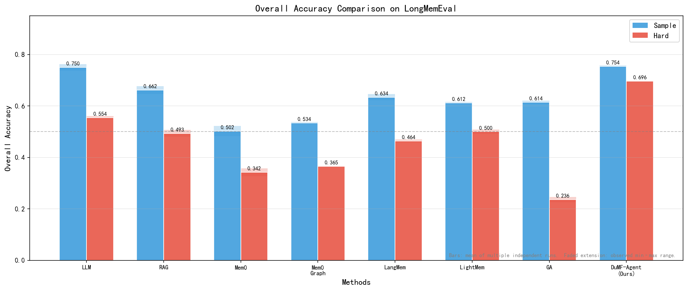

# DuMF-Agent: Dual-Channel Memory Framework for Long-Term Conversational Agents

A long-term memory architecture for conversational AI that addresses memory fragmentation, temporal confusion, and cross-session reasoning instability through unified memory representation, retrieval-reading closed-loop, and temporal version consistency mechanisms.

## Architecture Overview

```
┌─────────────────────────────────────────────────────────────────────────────┐
│                           DuMF-Agent Architecture                           │
├─────────────────────────────────────────────────────────────────────────────┤
│                                                                             │
│  ┌─────────────┐    ┌──────────────────────────────────────────────────┐   │
│  │   User      │    │              Dual-Channel Memory                 │   │
│  │   Query     │───▶│  ┌────────────────┐  ┌────────────────────────┐ │   │
│  └─────────────┘    │  │  RAW Channel   │  │  CONSOLIDATED Channel  │ │   │
│                     │  │  (Evidence)    │  │  (SimpleFact + Triple) │ │   │
│                     │  └────────────────┘  └────────────────────────┘ │   │
│                     └──────────────────────────────────────────────────┘   │
│                                      │                                      │
│                     ┌────────────────▼────────────────┐                    │
│                     │      Hybrid Retrieval           │                    │
│                     │  • Query Expansion              │                    │
│                     │  • Vector + BM25 + Multi-hop    │                    │
│                     │  • Unified Re-ranking           │                    │
│                     └────────────────┬────────────────┘                    │
│                                      │                                      │
│                     ┌────────────────▼────────────────┐                    │
│                     │      Context Construction       │                    │
│                     │  • Version Detection            │                    │
│                     │  • Temporal Filtering           │                    │
│                     │  • Evidence Organization        │                    │
│                     └────────────────┬────────────────┘                    │
│                                      │                                      │
│                     ┌────────────────▼────────────────┐                    │
│                     │         LLM Generation          │                    │
│                     └─────────────────────────────────┘                    │
│                                                                             │
└─────────────────────────────────────────────────────────────────────────────┘
```

## Key Features

- **Dual-Channel Memory Architecture**: RAW channel preserves evidence completeness; CONSOLIDATED channel structures facts for efficient retrieval — balances completeness and retrieval efficiency
- **Triple-SimpleFact Separation**: Structured Triple layer optimized for multi-hop reasoning; SimpleFact layer optimized for direct QA — decoupled optimization
- **Generalized Extractor**: Entities and relation types dynamically extracted from text without hardcoded schemas
- **Multi-Factor Comprehensive Scoring**: Fusion of semantic similarity, confidence, channel priority, and temporal decay for unified retrieval ranking
- **Dual-Dimensional Temporal Decay**: Time-aware weighting combining real-world timestamps and conversation turns for cross-session and intra-session reasoning
- **Append-Only Full Retention Storage**: No deletion — all historical versions preserved, enabling version tracking and temporal queries
- **Hybrid Retrieval + Query Expansion**: Vector similarity search, BM25 full-text search, and multi-hop graph traversal with query expansion

## Installation

### Prerequisites

- Python 3.9+
- Neo4j 5.x (local or Aura cloud)
- CUDA-compatible GPU (optional, for local embeddings)

### Setup

1. Clone the repository:
```bash
git clone https://github.com/leyulv-wang/long_memory_agent.git --branch v1.0.0
cd long_memory_agent
```

2. Create virtual environment:
```bash
python -m venv .venv
source .venv/bin/activate  # Linux/Mac
# or
.venv\Scripts\activate     # Windows
```

3. Install dependencies:
```bash
pip install -r requirements.txt
```

4. Configure environment:
```bash
cp .env.example .env
# Edit .env with your API keys and database credentials
```

5. Initialize Neo4j schema:
```bash
python utils/init_neo4j_schema.py
python utils/create_fulltext_index.py
```

6. (Optional) Start local embedding server:
```bash
python embedding_server.py
```

## Data Preparation

This project uses the [LongMemEval](https://github.com/xiaowu0162/LongMemEval) benchmark for evaluation.

### Download Dataset

```bash
# Clone LongMemEval repository
git clone https://github.com/xiaowu0162/LongMemEval.git

# Copy test files to your project
mkdir -p data/long_memory_eval
cp LongMemEval/data/*.json data/long_memory_eval/
```

### Verify Directory Structure

```
data/
└── long_memory_eval/
    ├── longmemeval_oracle.json   # Sample setting
    └── longmemeval_s.json        # Hard setting
```

## Configuration

### Environment Variables (.env)

Copy `.env.example` to `.env` and configure the following:

#### Required Settings

```bash
# LLM API (OpenAI-compatible)
GRAPHRAG_API_BASE=https://api.openai.com/v1
GRAPHRAG_CHAT_API_KEY=sk-your-api-key-here
GRAPHRAG_CHAT_MODEL=gpt-4o-mini

# Cheap LLM for extraction tasks
CHEAP_GRAPHRAG_API_BASE=https://api.openai.com/v1
CHEAP_GRAPHRAG_CHAT_API_KEY=sk-your-api-key-here
CHEAP_GRAPHRAG_CHAT_MODEL=gpt-4o-mini

# Embedding Model
GRAPHRAG_EMBEDDING_API_BASE=http://127.0.0.1:8000  # Local server
GRAPHRAG_EMBEDDING_API_KEY=local
GRAPHRAG_EMBEDDING_MODEL=BAAI/bge-m3

# Neo4j Database
NEO4J_URI=neo4j://127.0.0.1:7687
NEO4J_USERNAME=neo4j
NEO4J_PASSWORD=your-password-here
```

#### Optional Settings

```bash
# Evidence filtering: strict | medium | lenient
EVIDENCE_FILTER_LEVEL=lenient

# TextUnit fallback: off | order | always
EVIDENCE_TEXTUNIT_FALLBACK_SCOPE=order

# Confidence scores
RAW_REL_CONFIDENCE=0.95
CONSOLIDATED_REL_CONFIDENCE=0.85
CONSOLIDATED_ASSERTS_CONFIDENCE=0.6
```

### Key Parameters in config.py

| Parameter | Value | Description |
|-----------|-------|-------------|
| `SimpleFact k` | 100 | Top-k for SimpleFact retrieval |
| `TextUnit k` | 10 | Top-k for TextUnit retrieval |
| `Fulltext k` | 20 | Top-k for BM25 fulltext search |
| `Multi-hop limit` | 20 | Max nodes in graph expansion |
| `Multi-hop decay` | 0.85 | Score decay per hop |
| `Similarity weight` | 0.7 | Weight for semantic similarity |
| `Confidence weight` | 0.2 | Weight for fact confidence |
| `Channel weight` | 0.1 | Weight for channel priority |
| `Version threshold` | 0.75 | Threshold for version detection |

See `config.py` for all configurable parameters.

## Usage

### Basic Usage

```python
from agent.agent import DuMFAgent

# Initialize agent
agent = DuMFAgent(agent_id="user_001")

# Process conversation
response = agent.chat("What did we discuss about the project last week?")
```

## Running LongMemEval Evaluation

### Quick Start

Once you have the dataset and Neo4j database ready:

```bash
# Initialize database schema (first time only)
python utils/init_neo4j_schema.py
python utils/create_fulltext_index.py

# Run evaluation
python test/Long_Memory_test.py
```

Results will be saved to `test/long_memory_results.json`

**Note**: To test different settings (sample/hard), modify the `DEFAULT_DATA_PATH` in `test/Long_Memory_test.py` (line 47):
- Sample setting: `"data/long_memory_eval/longmemeval_oracle.json"`
- Hard setting: `"data/long_memory_eval/longmemeval_s.json"`

Or use command line argument:
```bash
python test/Long_Memory_test.py --data data/long_memory_eval/longmemeval_s.json
```

### Embedding Server

For local embedding (recommended for development):
```bash
# Start the embedding server first
python embedding_server.py

# Configure in .env:
# GRAPHRAG_EMBEDDING_API_BASE=http://127.0.0.1:8000
```

For online embedding API, configure SiliconFlow or other providers in `.env`.

## Project Structure

```
long_memory_agent/
├── agent/                  # Core agent implementation
│   ├── agent.py           # Main agent class
│   ├── simple_retriever.py # Hybrid retrieval system
│   └── context_builder.py  # Context construction
├── memory/                 # Dual-channel memory system
│   ├── dual_memory_system.py
│   ├── structured_memory.py
│   └── stores.py
├── temporal_reasoning/     # Temporal reasoning module
│   ├── executor.py
│   └── intent_router.py
├── prompts/               # Prompt templates
├── utils/                 # Utility functions
└── test/                  # Test scripts
```

## Troubleshooting

### Neo4j Connection Failed

```bash
# Check if Neo4j is running
neo4j status

# Start Neo4j
neo4j start

# Verify connection
python utils/connection_tests.py
```

### Embedding Server Issues

```bash
# If using local embedding, check server status
curl http://127.0.0.1:8000/health

# Alternative: Use online embedding API
# Edit .env:
GRAPHRAG_EMBEDDING_API_BASE=https://api.siliconflow.cn/v1
GRAPHRAG_EMBEDDING_API_KEY=your-api-key
```

### Out of Memory

```bash
# Reduce batch size in .env
EMBED_BATCH_SIZE=1
EMBED_MAX_CONCURRENCY=1
```

## Evaluation Results

Performance comparison on LongMemEval benchmark. All results averaged over 10 independent runs with ± half-range.



### Baseline Methods

- **LLM**: Direct LLM prompting with full conversation history
- **RAG**: Retrieval-augmented generation with vector search
- **Mem0**: Memory layer with fact extraction and consolidation
- **Mem0Graph**: Memory layer with graph-based structured memory
- **LangMem**: LangChain-based memory system
- **LightMem**: Lightweight memory architecture
- **Generative Agent**: Stanford's generative agents with memory stream (recency, importance, relevance scoring)
- **DuMF-Agent (ours)**: Dual-channel memory framework with structured reasoning and temporal consistency

### Overall Performance

| Method | Overall Acc. (sample) | Overall Acc. (hard) | Task-avg. Acc. (hard) |
|---:|---:|---:|---:|
| LLM | 75.00 ± 1.30 | 55.41 ± 0.68 | 54.20 ± 0.85 |
| RAG | 66.17 ± 1.51 | 49.33 ± 1.36 | 48.84 ± 1.34 |
| Mem0 | 50.22 ± 1.94 | 34.18 ± 1.53 | 33.97 ± 0.99 |
| Mem0Graph | 53.40 ± 0.31 | 36.52 ± 0.16 | 35.75 ± 0.10 |
| LangMem | 63.36 ± 1.22 | 46.40 ± 0.60 | 46.99 ± 0.53 |
| LightMem | 61.20 ± 0.40 | 50.00 ± 0.80 | 50.25 ± 0.75 |
| GA | 61.42 ± 0.65 | 23.56 ± 1.00 | 24.12 ± 1.26 |
| **DuMF-Agent** | **75.38 ± 0.37** | **69.59 ± 0.19** | **69.80 ± 0.23** |

### Single-session Tasks (Hard Setting)

| Method | ss-user | ss-preference | ss-assistant |
|---:|---:|---:|---:|
| LLM | 86.54 ± 1.92 | 11.77 ± 5.89 | 80.95 ± 4.76 |
| RAG | 80.77 ± 3.85 | 14.71 ± 2.94 | 88.10 ± 7.15 |
| Mem0 | 58.34 ± 2.78 | 14.29 ± 7.15 | 19.23 ± 3.85 |
| Mem0Graph | 63.79 ± 1.73 | 8.33 ± 0.93 | 22.09 ± 1.16 |
| LangMem | 74.29 ± 1.43 | 38.34 ± 1.67 | 22.32 ± 0.89 |
| LightMem | 68.57 ± 1.43 | 45.00 ± 1.67 | 30.36 ± 1.79 |
| GA | 30.36 ± 1.79 | 10.42 ± 2.08 | 40.91 ± 1.52 |
| **DuMF-Agent** | **88.14 ± 1.30** | **54.41 ± 1.47** | **91.86 ± 1.17** |

### Multi-session Tasks

| Method | Multi-session (sample) | Multi-session (hard) |
|---:|---:|---:|
| LLM | 62.80 ± 2.33 | 39.07 ± 1.57 |
| RAG | 66.28 ± 1.16 | 45.23 ± 1.66 |
| Mem0 | 55.82 ± 2.33 | 28.95 ± 2.63 |
| Mem0Graph | 57.41 ± 1.85 | 32.65 ± 2.04 |
| LangMem | 56.00 ± 4.00 | 42.86 ± 1.51 |
| LightMem | 45.10 ± 0.75 | 36.84 ± 0.75 |
| GA | 55.44 ± 1.09 | 24.36 ± 1.29 |
| **DuMF-Agent** | **66.28 ± 1.17** | **51.02 ± 2.05** |

### Temporal & Knowledge Update Tasks

| Method | temporal (sample) | temporal (hard) | knowledge (sample) | knowledge (hard) |
|---:|---:|---:|---:|---:|
| LLM | 51.14 ± 1.14 | 42.60 ± 1.86 | 83.73 ± 2.33 | 62.79 ± 9.22 |
| RAG | 46.59 ± 1.14 | 22.22 ± 3.70 | 69.77 ± 2.33 | 42.00 ± 2.00 |
| Mem0 | 36.37 ± 6.82 | 36.11 ± 2.78 | 63.96 ± 1.17 | 46.88 ± 3.13 |
| Mem0Graph | 60.35 ± 1.73 | 43.10 ± 1.73 | 65.00 ± 8.33 | 44.56 ± 1.09 |
| LangMem | 50.00 ± 3.85 | 32.33 ± 0.75 | 72.49 ± 3.52 | 71.80 ± 1.29 |
| LightMem | 59.03 ± 0.38 | 51.50 ± 1.13 | 73.72 ± 0.64 | 69.87 ± 1.93 |
| GA | 38.37 ± 1.16 | 21.88 ± 5.21 | 69.77 ± 2.33 | 16.96 ± 0.89 |
| **DuMF-Agent** | **69.32 ± 1.14** | **58.33 ± 2.08** | **79.07 ± 2.33** | **75.00 ± 1.79** |

### Ablation Study

Single-run results on sample setting.

#### w/o Structured Reasoning + Multi-hop

| Method | Overall | Multi-session | Temporal-reasoning |
|---:|---:|---:|---:|
| DuMF-Agent (Full) | **72.41** | **65.12** | **68.18** |
| w/o Structured Reasoning | 70.00 | 60.00 | 53.85 |

#### w/o RAW Channel

| Method | Overall (sample) | Overall (hard) | Multi-session (hard) |
|---:|---:|---:|---:|
| DuMF-Agent (Full) | **72.41** | **67.35** | **47.37** |
| w/o RAW Memory | 68.57 | 60.00 | 33.33 |

#### w/o Retrieval Strategies

| Method | Overall | ss-preference | Multi-session | Temporal-reasoning |
|---:|---:|---:|---:|---:|
| DuMF-Agent (Full) | **72.41** | **62.96** | **65.12** | **68.18** |
| w/o QueryExpand+BM25 | 64.29 | 30.00 | 46.15 | 53.85 |
| w/o Composite Scoring | 62.86 | 50.00 | 38.46 | 46.15 |

#### w/o Temporal Modeling + Version Retention

| Method | Temporal-reasoning | Knowledge-update | Overall |
|---:|---:|---:|---:|
| DuMF-Agent (Full) | **68.18** | **74.42** | **72.41** |
| w/o Temporal Modeling | 53.85 | 58.33 | 67.14 |

### Abstention Accuracy

| Method | Sample | Hard |
|---:|---:|---:|
| LLM | 69.23 | 61.11 |
| RAG | 84.62 | 66.67 |
| Mem0 | 96.15 | 84.62 |
| Mem0Graph | 90.47 | 73.82 |
| LangMem | 95.00 | 86.67 |
| LightMem | 66.67 | 53.33 |
| GA | 96.15 | 92.30 |
| DuMF-Agent | 42.31 | 53.85 |

DuMF-Agent achieves the lowest abstention rate while maintaining the highest accuracy, demonstrating that the system confidently answers questions rather than abstaining, and those answers remain highly accurate.

## License

This project is licensed under the MIT License - see the [LICENSE](LICENSE) file for details.

## Acknowledgments

- LongMemEval benchmark for evaluation framework
- Neo4j for graph database support
